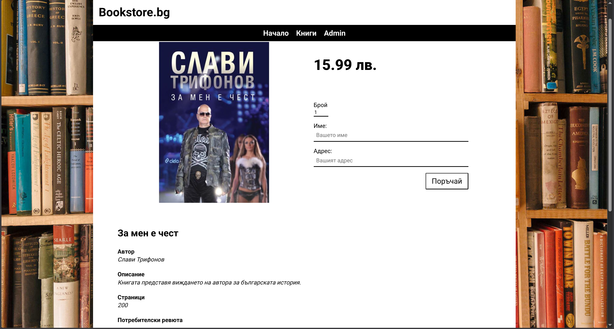
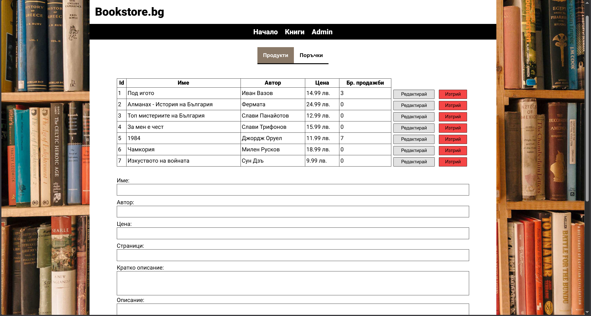
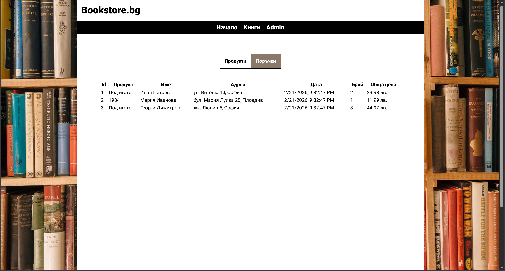

# Bookstore

A basic online bookstore written in vanilla HTML, CSS and JS with a basic CRUD Spring backend for dynamic data. 

## Overview

The project explores the core technologies of websites - mainly vanilla HTML, CSS and JS.
It showcases a very basic incomplete online bookstore with an admin panel but no users and authentication.
The focus was on learning HTML, CSS and JS.

- **Subject**: Internet Technologies
- **Semester**: 4
- **Year**: 2022

## Features

- Store page
- Book overview page
- Book Reviews
- Order books
- Admin panel
  - See orders
  - Add books to the store
  - Edit books
  - Remove books

## Screenshots

### Store page

### Book page

### Admin products page

### Admin orders page

## Tech Stack

- Frontend
  - vanilla HTML
  - vanilla CSS
  - vanilla JS
- Backend
  - Java
  - SpringBoot
  - PostgreSQL

## Running locally

1. Install docker-compose and docker
2. Open a terminal in the root directory
3. Run the following command in the terminal `docker-compose up -d`
4. Access the frontend at `http://localhost:80`